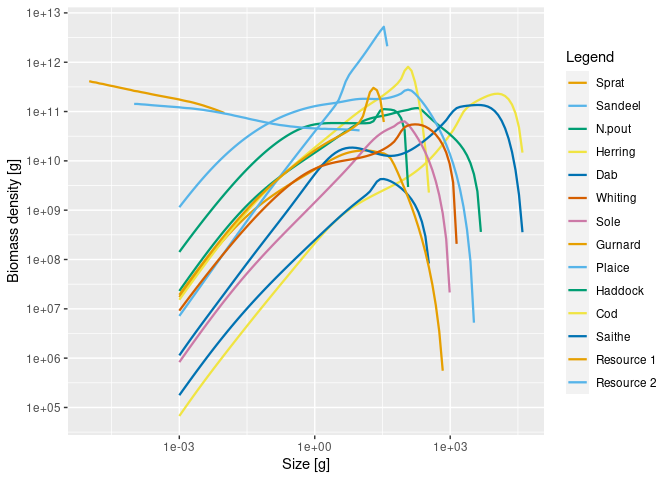

<!-- README.md is generated from README.Rmd. Please edit that file -->

# mizerMR <a href='https://sizespectrum.org/mizerMR'>

<!-- badges: start -->

[](https://lifecycle.r-lib.org/articles/stages.html#experimental)
<!-- badges: end -->

This extension package for mizer allows you to work with multiple
size-structured background resources in the same way in which you work with
multiple species in mizer. Modelled species can have different preferences 
for different resources, defined though maximum availability of resource 
available to species, in a similar way as setting species interaction matrix. 
    Each background resource can have different minimum and maximum sizes, and 
    different size spectrum slopes (lambda) or abundances (kappa). This allows 
    the user to reproduce emergent onto-genetic dietary shifts, where a species feed 
    in a plankton spectrum when it is small, then switches to benthic spectrum, and 
    later to other fish species. 

# Installation

``` r
remotes::install_github("sizespectrum/mizerMR")
library(mizerMR)
```

# Setting up a model with multiple resources

Multiple size-structured resources are set up in a very similar manner
to multiple species. Just as for multiple species we need a
`species_params` data frame with the information about the species, for
multiple resources we need a `resource_params` data frame, with one row
for each resource. Here is an artificial example with two resources:

``` r
library(tibble)
resource_params <- tribble(
    ~resource,  ~kappa, ~lambda, ~r_pp, ~w_min, ~w_max,
 "Resource 1",    1e11,    2.13,     4,    NA ,   0.01,
 "Resource 2",    1e11,    2.05,    10,   1e-4,     NA
)
```

Similarly to how we can set resource parameters for a single resource in
standard mizer with `setResource()`, you can now set multiple resources
with `setMultipleResources()`. So if for example we wanted to add these
resources to the North Sea model described by the `NS_params`
MizerParams object, we would do

``` r
params <- setMultipleResources(NS_params, resource_params)
```

This has given us a new MizerParams object in which the original
resource has been replaced by our two resources. We can then work with
this MizerParams object as usual. For example we can project it forward
in time:

``` r
sim <- project(params, t_max = 2, t_save = 0.2)
```

and plot the resulting spectra:

``` r
plotSpectra(sim, power = 2)
```



We can also animate the spectra with `animateSpectra(sim)`. Most mizer
functions will work as usual.

We can access the simulation results for the resource with
`NResource()`. This gives a three-dimensional array:

``` r
str(NResource(sim))
#>  num [1:11, 1:2, 1:226] 9.87e+37 9.87e+37 9.87e+37 9.87e+37 9.87e+37 ...
#>  - attr(*, "dimnames")=List of 3
#>   ..$ time    : chr [1:11] "0" "0.2" "0.4" "0.6" ...
#>   ..$ resource: chr [1:2] "Resource 1" "Resource 2"
#>   ..$ w       : chr [1:226] "2.12e-13" "2.53e-13" "3.02e-13" "3.61e-13" ...
```

So the first dimension is the time, the second the resource and the
third the size. Thus to get the abundance density of Resource 2 at time
0.6 at sizes between 0.1g and 5g we could do

``` r
select_w <- w_full(params) >= 1 & w_full(params) <= 5
NResource(sim)["0.6", "Resource 2", select_w]
#>        1.18         1.4        1.68           2        2.39        2.85 
#> 29171099375 20197414266 14020889066  9759285393  6811166565  4765970415 
#>         3.4        4.06        4.84 
#>  3342985300  2349927216  1654807045
```

This is perfectly analogous to how we would access the abundance density
of fish species, except that the range of sizes is given by `w_full`
rather than by `w`.

# More details

Just as we are able to specify how strongly a predator species interacts
with a prey species via the `interaction` matrix, we can also specify
how strongly a predator species interacts with each resource via the
`resource_interaction`, which is a matrix with one row for each species
and one column for each resource. For example

``` r
resource_interaction <- matrix(runif(24), nrow = 12, ncol = 2)
params <- setMultipleResources(NS_params, resource_params, resource_interaction)
```

Resource parameters can be changed at any time. For example we can
double the carrying capacity of the first resource with

``` r
resource_params(params)$kappa[1] <- 2 * resource_params(params)$kappa[1]
```

We can also use this kind of notation as an alternative to
`setMultispeciesParams()`. For example

``` r
params <- NS_params
resource_params(params) <- resource_params
resource_interaction(params) <- resource_interaction
```

By default the initial values for the resources will be equal to the
carrying capacities. But if a user has their own array (resource x size)
of resource number densities `my_n_resource` they can set these as the
initial values with

``` r
initialNResource(params) <- my_n_resource
```

Users who are not happy with the allometric expressions for the resource
carrying capacities or the replenishment rates but have created their
own matrices `my_capacity` and `my_rate` with one row for each resource
and one column for each size can set these with

``` r
resource_capacity(params) <- my_capacity
resource_rate(params) <- my_rate
```

Rather than adding the multiple resources to an existing model, the user
can also create a new model with multiple resources with

``` r
params <- newMRParams(species_params, interaction, resource_params,
                      resource_interaction, gear_params)
```
